# Single Cycle RISC-V CPU

A single-cycle RISC-V CPU implemented in SystemVerilog and verified using ModelSim.

## Current Progress

- [x] ALU
- [x] Register File
- [x] Immediate Generator
- [x] Control Unit
- [x] ALU Control
- [x] Program Counter
- [x] Instruction Memory
- [ ] Data Memory
- [ ] Datapath
- [ ] Top-Level CPU Integration

---

# ALU

## Features

- ADD
- SUB
- AND
- OR
- XOR
- Shift Left Logical (SLL)
- Shift Right Logical (SRL)

## Files

- `src/alu.sv`
- `tb/alu_tb.sv`

## Simulation Results

### Transcript

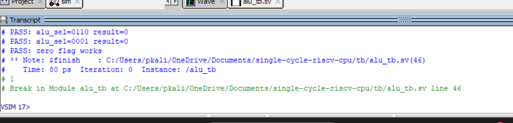

### Waveform

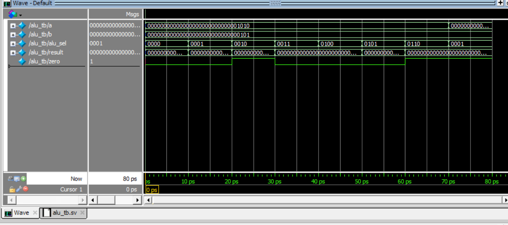

---

# Register File

## Features

- 32 general-purpose registers
- Dual read ports
- Single write port
- Register x0 hardwired to zero

## Files

- `src/reg_file.sv`
- `tb/reg_file_tb.sv`

## Simulation Results

### Transcript

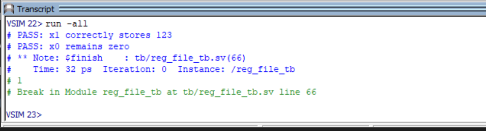

### Waveform

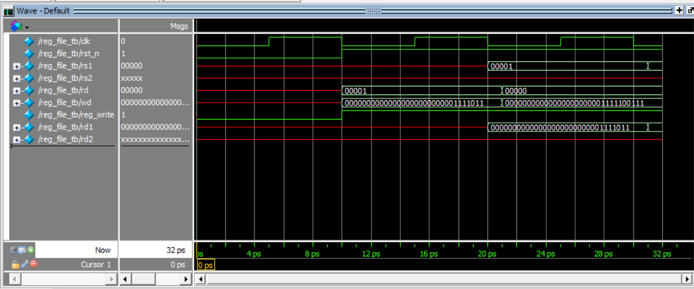

---

# Immediate Generator

## Features

- I-type immediate extraction
- Load immediate extraction
- Store immediate extraction
- Branch immediate extraction
- Sign extension to 32 bits

## Files

- `src/imm_gen.sv`
- `tb/imm_gen_tb.sv`

## Simulation Results

### Transcript

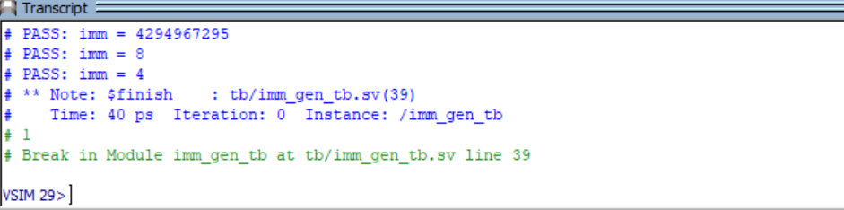

### Waveform

---

# Control Unit

## Features

- R-type instruction decoding
- I-type instruction decoding
- Load instruction decoding
- Store instruction decoding
- Branch instruction decoding
- Generates datapath control signals

## Files

- `src/control_unit.sv`
- `tb/control_unit_tb.sv`

## Simulation Results

### Transcript

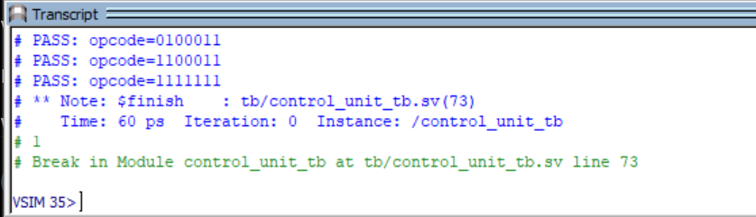

### Waveform

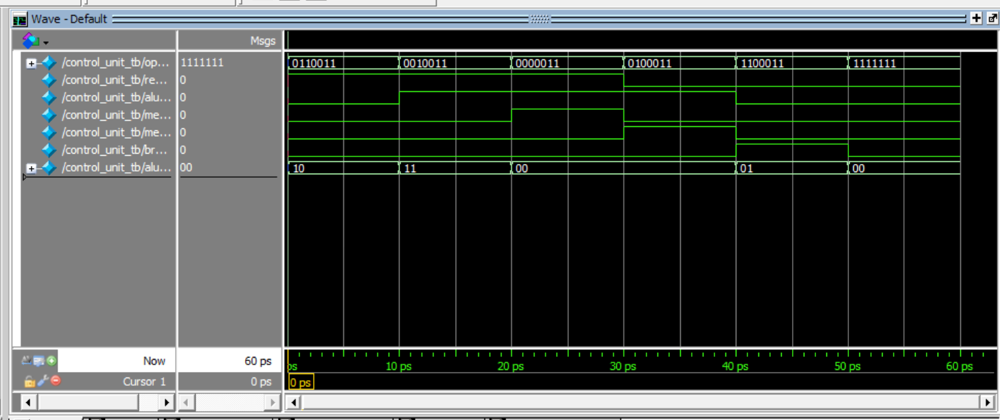

---

# ALU Control

## Features

- Decodes ALU operations using:
  - `alu_op`
  - `funct3`
  - `funct7`

- Supports:
  - ADD
  - SUB
  - AND
  - OR
  - XOR
  - SLL
  - SRL
  - ADDI
  - ANDI
  - ORI
  - XORI
  - SLLI
  - SRLI

## Files

- `src/alu_control.sv`
- `tb/alu_control_tb.sv`

## Simulation Results

### Transcript

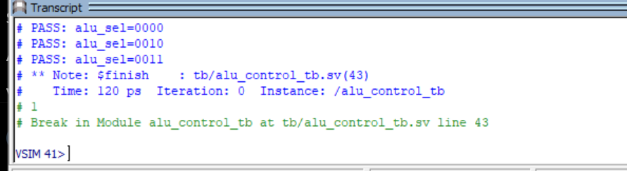

### Waveform

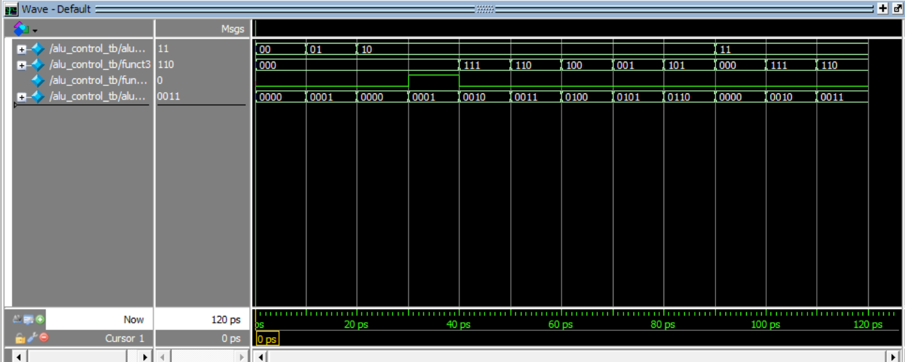

---

# Program Counter

## Features

- 32-bit program counter
- Updates on positive clock edge
- Asynchronous reset to zero

## Files

- `src/program_counter.sv`
- `tb/program_counter_tb.sv`

## Simulation Results

### Transcript

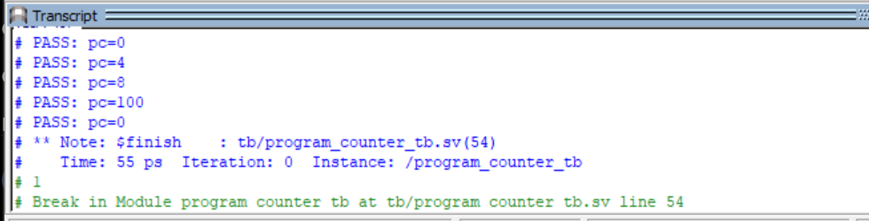

### Waveform

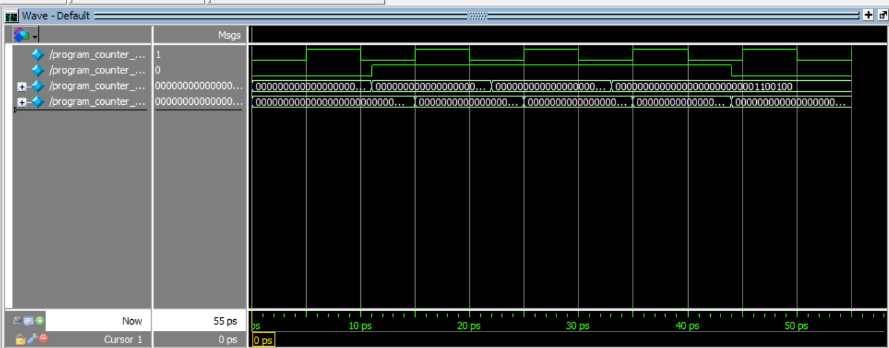

---

# Instruction Memory

## Features

- 256-word instruction memory
- Stores 32-bit RISC-V instructions
- Uses word-aligned addressing
- Supports instruction fetch operations

## Files

- `src/instruction_memory.sv`
- `tb/instruction_memory_tb.sv`

## Simulation Results

### Transcript

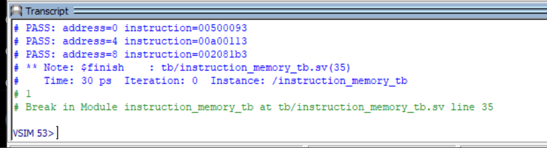

### Waveform

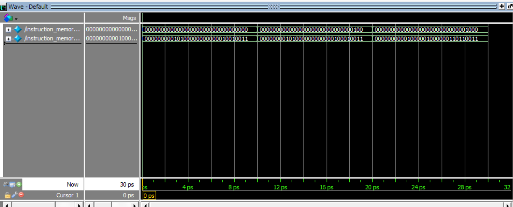

---

## Tools Used

- SystemVerilog
- ModelSim Intel FPGA Edition
- Git
- GitHub
- VS Code