# Single Cycle and Pipelined RISC-V CPU

A modular RISC-V CPU implemented in SystemVerilog and verified using ModelSim. The project began as a single-cycle processor and has been extended into a fully functional 5-stage pipelined processor with forwarding, hazard detection, and branch handling.

---

## Current Progress

### Single-Cycle CPU
* [x] ALU
* [x] Register File
* [x] Immediate Generator
* [x] Control Unit
* [x] ALU Control
* [x] Program Counter
* [x] Instruction Memory
* [x] Data Memory
* [x] Datapath Integration
* [x] CPU Top-Level Integration
* [x] End-to-End Program Execution Test

### Pipelined CPU
* [x] IF/ID Pipeline Register
* [x] ID/EX Pipeline Register
* [x] EX/MEM Pipeline Register
* [x] MEM/WB Pipeline Register
* [x] 5-Stage Pipeline Integration
* [x] Forwarding Unit
* [x] Forwarding Integration
* [x] Hazard Detection Unit
* [x] Load-Use Hazard Handling
* [x] Branch Unit
* [x] Branch Flush Logic
* [x] Branch CPU Verification
* [ ] FPGA Implementation

---

# Single-Cycle Architecture

```text
Program Counter
      ↓
Instruction Memory
      ↓
Control Unit
      ↓
Register File
      ↓
Immediate Generator
      ↓
ALU
      ↓
Data Memory
      ↓
Writeback
```

---

# Pipelined Architecture

```text
IF → ID → EX → MEM → WB
```

Pipeline structure:

```text
Program Counter
      ↓
Instruction Memory
      ↓
IF/ID Register
      ↓
Instruction Decode
      ↓
ID/EX Register
      ↓
Execute (ALU + Forwarding)
      ↓
EX/MEM Register
      ↓
Memory Access
      ↓
MEM/WB Register
      ↓
Writeback
```

---

# ALU

## Features

* ADD
* SUB
* AND
* OR
* XOR
* Shift Left Logical (SLL)
* Shift Right Logical (SRL)

## Files

* `src/alu.sv`
* `tb/alu_tb.sv`

## Simulation Results

### Transcript


### Waveform


---

# Register File

## Features

* 32 general-purpose registers
* Dual read ports
* Single write port
* Register x0 hardwired to zero

## Files

* `src/reg_file.sv`
* `tb/reg_file_tb.sv`

## Simulation Results

### Transcript


### Waveform


---

# Immediate Generator

## Features

* I-type immediate extraction
* Load immediate extraction
* Store immediate extraction
* Branch immediate extraction
* Sign extension to 32 bits

## Files

* `src/imm_gen.sv`
* `tb/imm_gen_tb.sv`

## Simulation Results

### Transcript


### Waveform


---

# Control Unit

## Features

* R-type instruction decoding
* I-type instruction decoding
* Load instruction decoding
* Store instruction decoding
* Branch instruction decoding
* Generates datapath control signals

## Files

* `src/control_unit.sv`
* `tb/control_unit_tb.sv`

## Simulation Results

### Transcript


### Waveform


---

# ALU Control

## Features

* Decodes ALU operations using:
  * `alu_op`
  * `funct3`
  * `funct7`

* Supports:
  * ADD
  * SUB
  * AND
  * OR
  * XOR
  * SLL
  * SRL
  * ADDI
  * ANDI
  * ORI
  * XORI
  * SLLI
  * SRLI

## Files

* `src/alu_control.sv`
* `tb/alu_control_tb.sv`

## Simulation Results

### Transcript


### Waveform


---

# Program Counter

## Features

* 32-bit program counter
* Positive-edge clock update
* Asynchronous reset

## Files

* `src/program_counter.sv`
* `tb/program_counter_tb.sv`

## Simulation Results

### Transcript


### Waveform


---

# Instruction Memory

## Features

* 256-word memory
* Stores RISC-V instructions
* Word-aligned addressing
* Supports instruction fetch

## Files

* `src/instruction_memory.sv`
* `tb/instruction_memory_tb.sv`

## Simulation Results

### Transcript


### Waveform


---

# Data Memory

## Features

* 256-word memory
* Synchronous write
* Combinational read
* Word-aligned addressing

## Files

* `src/data_memory.sv`
* `tb/data_memory_tb.sv`

## Simulation Results

### Transcript

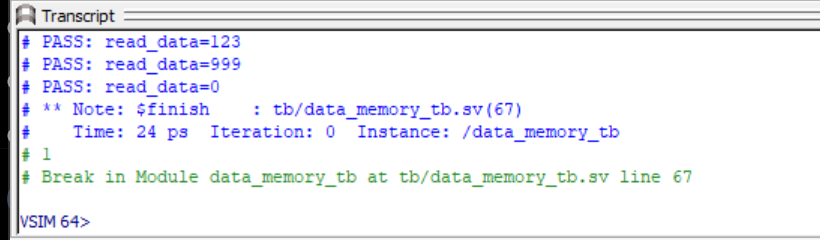

### Waveform

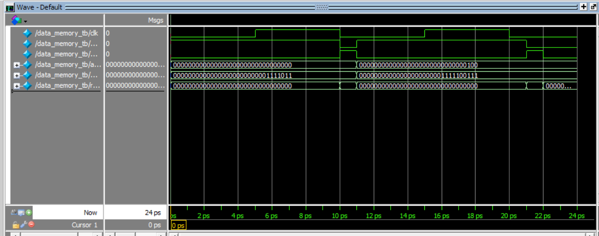

---

# CPU Top-Level Integration

## Features

* Connects Control Unit, ALU Control, and Datapath
* Executes instruction fetch sequence
* Supports instruction decode
* Supports ALU execution
* Supports memory access
* Supports writeback

## Files

* `src/cpu_top.sv`
* `tb/cpu_top_tb.sv`

## Simulation Results

### Transcript

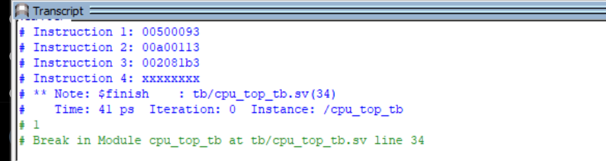

### Waveform

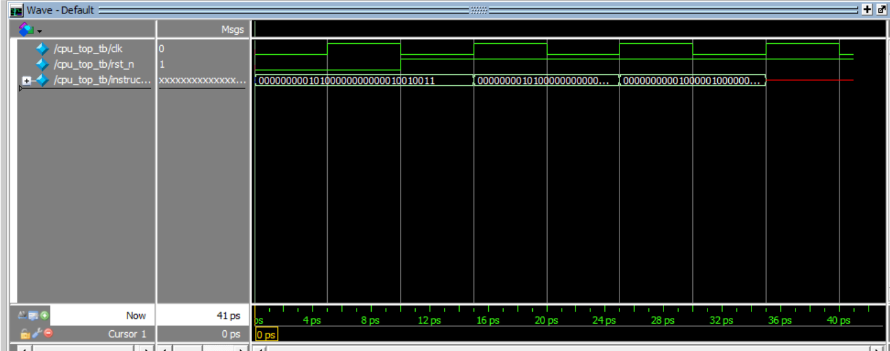

---

# Pipeline Registers

## IF/ID Register

### Files

* `src/pipeline_regs/if_id_reg.sv`
* `tb/if_id_reg_tb.sv`

### Transcript


### Waveform


---

## ID/EX Register

### Files

* `src/pipeline_regs/id_ex_reg.sv`
* `tb/id_ex_reg_tb.sv`

### Transcript


### Waveform


---

## EX/MEM Register

### Files

* `src/pipeline_regs/ex_mem_reg.sv`
* `tb/ex_mem_reg_tb.sv`

### Transcript


### Waveform


---

## MEM/WB Register

### Files

* `src/pipeline_regs/mem_wb_reg.sv`
* `tb/mem_wb_reg_tb.sv`

### Transcript


### Waveform


---

# Advanced Pipeline Features

## Forwarding Unit

The forwarding unit resolves RAW (Read After Write) data hazards by forwarding results from the EX/MEM and MEM/WB pipeline stages directly to the ALU inputs, eliminating stalls for back-to-back register-dependent instructions.

### Forwarding Logic

| `forward_a` / `forward_b` | Source |
|---|---|
| `2'b00` | Register file (no forwarding) |
| `2'b10` | EX/MEM stage result |
| `2'b01` | MEM/WB stage result |

### Files

* `src/forwarding_unit.sv`
* `tb/forwarding_unit_tb.sv`

### Simulation Results

#### Transcript


#### Waveform


---

## Load-Use Hazard Detection

The hazard detection unit identifies load-use hazards where a `lw` instruction is immediately followed by an instruction that reads the loaded register. When detected, the pipeline is stalled for one cycle by freezing the PC and IF/ID register, and inserting a bubble into the ID/EX register.

### Hazard Condition
```text
lw x1, 0(x0)
add x2, x1, x3
```

Without hazard detection, the ADD instruction would read stale data before the load completed.

### Files

* `src/hazard_detection_unit.sv`
* `tb/hazard_cpu_tb.sv`

### Simulation Results

#### Hazard Detection Unit Transcript


#### Hazard Detection Unit Waveform


#### Load-Use Hazard CPU Transcript


#### Load-Use Hazard CPU Waveform


---

## Branch Handling

The branch unit supports conditional branch execution and pipeline flushing for taken branches.

When a branch is taken:

1. The branch target address is calculated in the EX stage.
2. The program counter is redirected.
3. Incorrect instructions already fetched are flushed from the pipeline.
4. Execution resumes at the correct branch target.

### Files

* `src/branch_unit.sv`
* `tb/branch_unit_tb.sv`
* `tb/branch_cpu_tb.sv`

### Simulation Results

#### Branch Unit Transcript

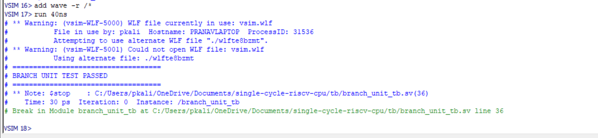

#### Branch Unit Waveform

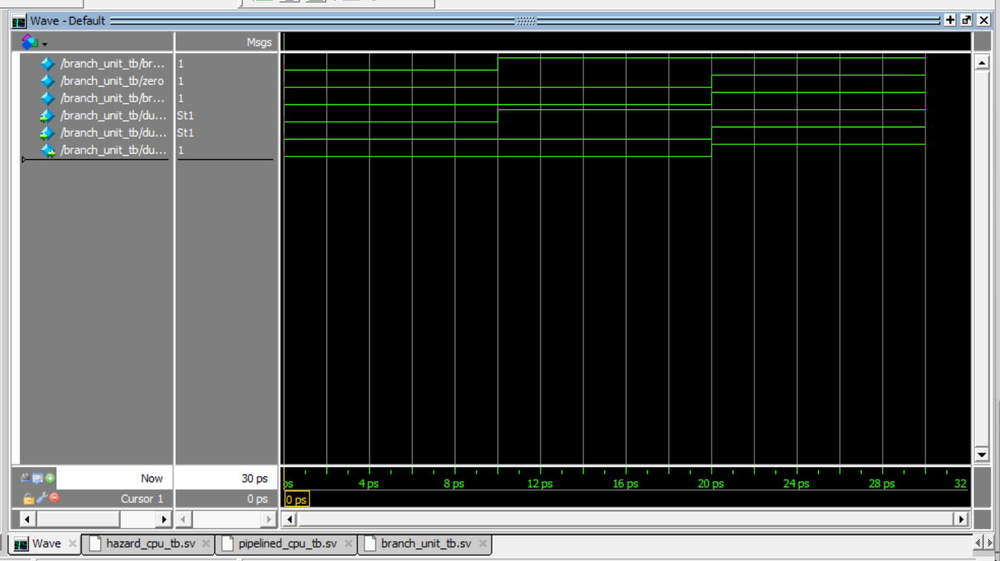

#### Branch CPU Transcript

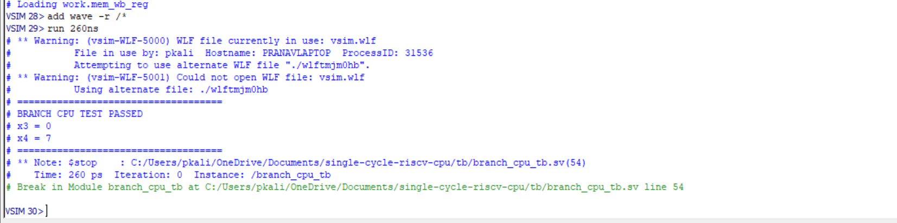

#### Branch CPU Waveform

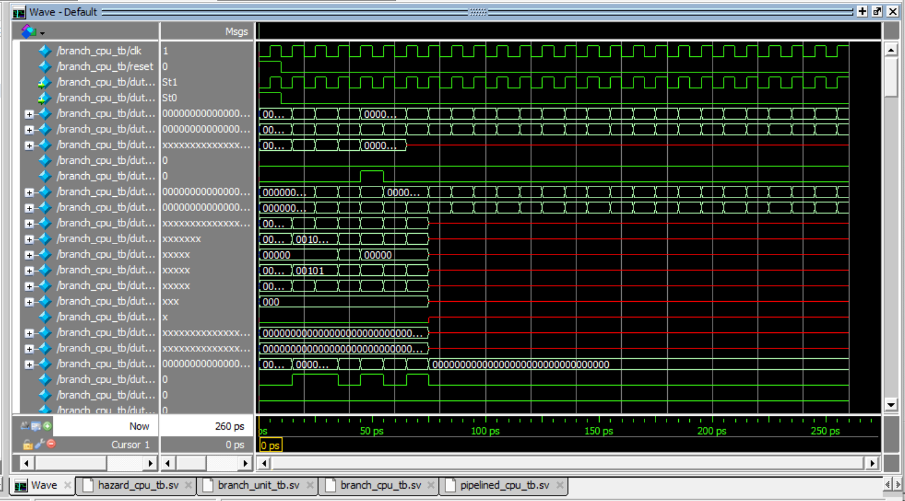

---

# Full CPU Verification Suite

After implementing forwarding, hazard detection, and branch handling, a complete CPU-level verification suite was created to validate end-to-end processor functionality.

---

## Final ALU Verification

Verifies correct execution of:

* ADD
* SUB
* AND
* OR
* XOR

### Files

* `tb/final_alu_cpu_tb.sv`

### Simulation Results

#### Transcript

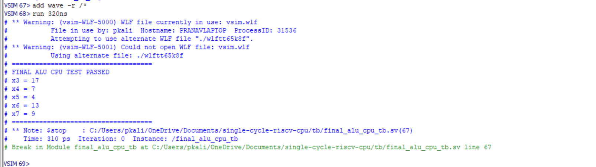

#### Waveform

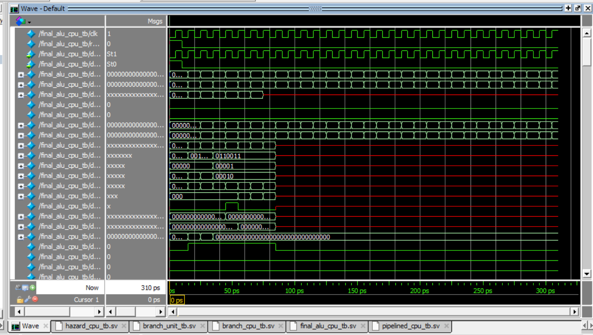

---

## Final Memory Verification

Verifies:

* Store operations
* Load operations
* Memory writeback path
* Register writeback path

### Files

* `tb/final_memory_cpu_tb.sv`

### Simulation Results

#### Transcript

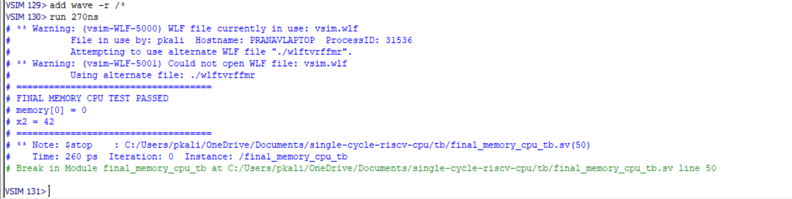

#### Waveform

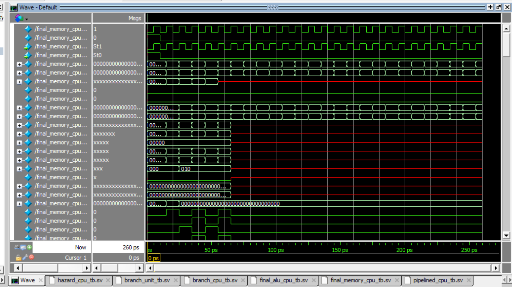

---

## Final Forwarding Verification

Stress-test of chained data dependencies across multiple pipeline stages.

### Files

* `tb/final_forwarding_cpu_tb.sv`

### Simulation Results

#### Transcript

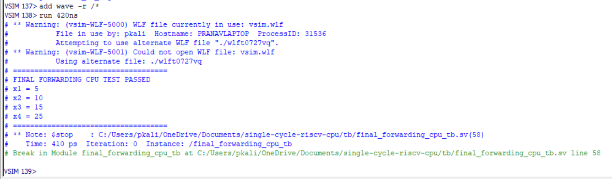

#### Waveform

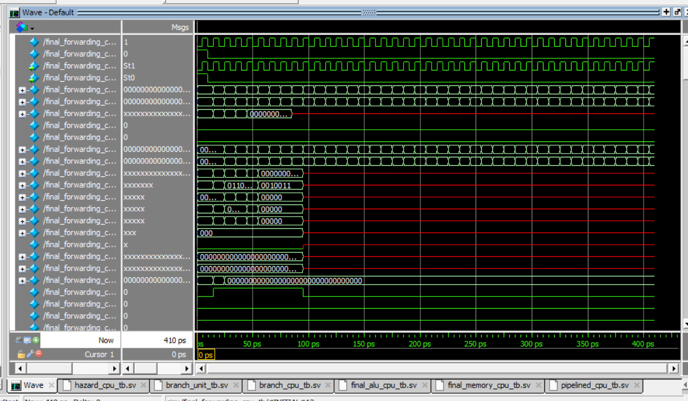

---

## Final Branch Not-Taken Verification

Verifies correct execution when branch conditions evaluate false and pipeline flushing is not triggered.

### Files

* `tb/final_branch_not_taken_cpu_tb.sv`

### Simulation Results

#### Transcript

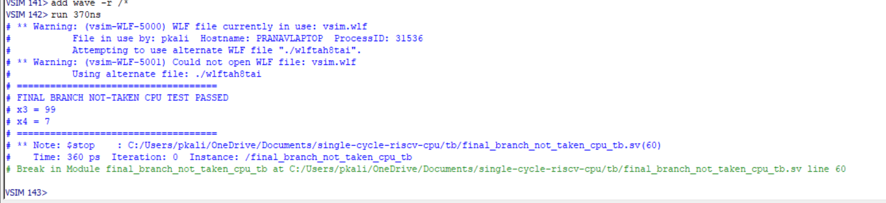

#### Waveform

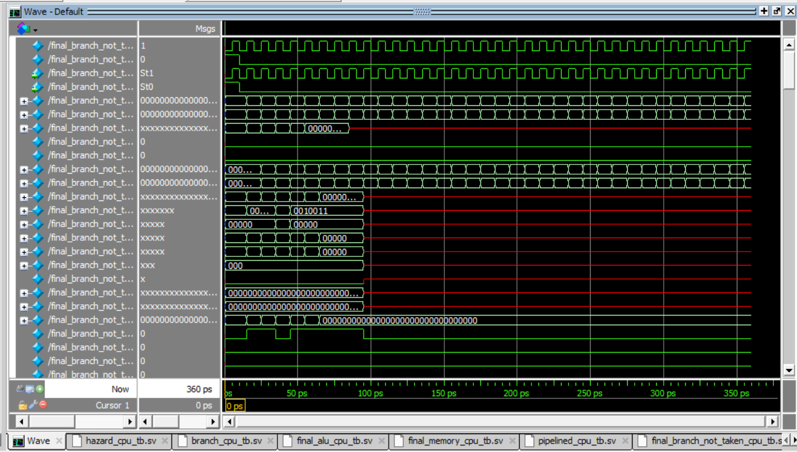

---

# Verification Summary

The processor has been verified at:

### Module Level

* ALU
* Register File
* Immediate Generator
* Control Unit
* ALU Control
* Program Counter
* Instruction Memory
* Data Memory
* Pipeline Registers
* Forwarding Unit
* Hazard Detection Unit
* Branch Unit

### CPU Level

* Single-Cycle CPU Execution
* Pipeline Integration
* Forwarding Verification
* Load-Use Hazard Verification
* Branch Taken Verification
* Branch Not Taken Verification
* ALU Verification
* Memory Verification

---

# Future Work

## FPGA Implementation

Planned next steps:

* Synthesize processor in Vivado
* Deploy on Basys 3 FPGA
* Create FPGA constraints file
* Connect clock and reset inputs
* Load instruction memory on hardware
* Verify execution using FPGA resources

Current project status:

* Architecture: Complete
* Pipeline Features: Complete
* Verification: Complete
* FPGA Implementation: In Progress

```
```
